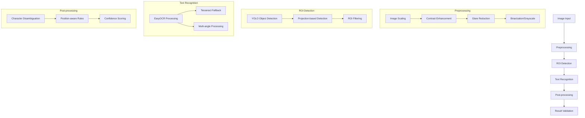

# Apple OCR System Architecture and Technical Documentation

## 1. System Overview

The Apple OCR Backend is a specialized optical character recognition (OCR) system designed to extract serial numbers from Apple device images. The system employs a multi-stage progressive processing pipeline that balances accuracy and performance, with device-specific optimizations for different Apple products.

## 2. Core Components

### 2.1 OCR Pipeline Architecture



### 2.2 Key Components

#### 2.2.1 Preprocessing Module (`preprocess_image`)
- **Purpose**: Enhances image quality for better OCR accuracy
- **Key Features**:
  - Adaptive upscaling (2x-4x) based on device type
  - CLAHE contrast enhancement
  - Bilateral filtering for noise reduction
  - Glare reduction with auto-selection
  - Morphological operations for cleaning binary images
  - Sharpening for text edge enhancement

#### 2.2.2 ROI Detection Module
- **Primary Method**: YOLO-based detection (`detect_serial_regions`)
  - Uses YOLOv5n model to identify serial number regions
  - Provides tight bounding boxes around text
  - Fast inference with GPU acceleration
- **Fallback Method**: Projection-based detection (`_find_rois_by_projection`)
  - Uses horizontal projections to find text bands
  - Adaptive padding based on ROI height
  - Filtering by minimum width and energy

#### 2.2.3 OCR Engine
- **Primary Engine**: EasyOCR
  - PyTorch-based OCR with GPU acceleration
  - MPS support for Apple Silicon
  - Character allowlist for Apple serials (A-Z0-9)
- **Fallback Engine**: Tesseract OCR
  - Used when EasyOCR fails to detect text
  - Different preprocessing approach for Tesseract

#### 2.2.4 Post-processing Module
- **Character Disambiguation** (`_normalize_ambiguous`, `_expand_ambiguous`)
  - Position-aware rules for Apple serial patterns
  - Handles common confusion cases (0/O, 1/I, F/E, etc.)
- **Result Validation**
  - Format checking for Apple serial numbers
  - Confidence scoring and thresholding

### 2.3 Progressive Processing Pipeline

The system uses a multi-stage approach that progressively increases processing complexity:

1. **Stage 1: Fast Processing**
   - Quick preprocessing with minimal parameters
   - YOLO ROI detection for focused processing
   - Basic OCR with limited rotations
   - Early stopping if high confidence results found

2. **Stage 2: Medium Processing**
   - More thorough preprocessing
   - Tries both grayscale and binary modes
   - Processes inverted images if needed
   - Uses adaptive glare reduction

3. **Stage 3: Full Processing**
   - Maximum upscaling (4x)
   - Multi-scale glare reduction
   - Fine-grained rotation angles
   - More permissive OCR parameters

4. **Stage 4: Tesseract Fallback**
   - Uses Tesseract OCR as last resort
   - Special preprocessing for Tesseract
   - Results merged with EasyOCR results

## 3. Technical Implementation Details

### 3.1 GPU Acceleration

The system leverages GPU acceleration through PyTorch:

- **CUDA Support**: For NVIDIA GPUs
- **MPS Support**: For Apple Silicon (M1/M2/M3)
- **Memory Management**:
  - `torch.cuda.empty_cache()` for CUDA
  - `PYTORCH_MPS_HIGH_WATERMARK_RATIO=0.0` for MPS
  - Batch size control for optimal performance

### 3.2 Character Disambiguation Rules

Position-aware rules for Apple serial numbers:

1. **First 3 positions (0-2)**: Prefer letters over digits
   - 0 → O, 1 → I, 2 → Z, 5 → S, 8 → B

2. **Middle positions (3-7)**: Special patterns for Apple serials
   - E → F (positions 5-7): Fix common confusion
   - J → I (positions 5-7): Fix common confusion

3. **Last 4 positions (8-11)**: Prefer digits over letters
   - O → 0, I → 1, Z → 2, S → 5, B → 8, etc.

### 3.3 Device-Specific Presets

Optimized parameters for different device types:

1. **MacBook/Mac**: Etched serials (higher contrast, physical depth)
   - Mode: gray
   - Upscale: 2.5x
   - Glare reduction: adaptive
   - Low text: 0.3

2. **iPhone/iPad**: Screen-based serials (lower contrast)
   - Mode: gray
   - Upscale: 3.0x
   - Glare reduction: multi
   - Low text: 0.2
   - Mag ratio: 1.5

3. **Apple Silicon**: Optimized for M1/M2/M3 Macs
   - Mode: gray
   - Upscale: 4.0x
   - Glare reduction: multi
   - Low text: 0.12
   - Mag ratio: 1.8

### 3.4 Smart Rotation

The system uses intelligent rotation angle selection:

- **Orientation Detection**: Analyzes image projections to determine text orientation
- **Priority Order**: Prioritizes detected orientation and its opposite
- **Fine-grained Rotations**: Adds small angle variations (±7°, ±15°) if needed
- **Early Stopping**: Stops rotation testing when high confidence results are found

## 4. API Endpoints

### 4.1 Main Endpoint: `/process-serial`

- **Method**: POST
- **Input**: Multipart form with image file
- **Parameters**:
  - `device_type`: Type of Apple device (macbook, iphone, etc.)
  - `preset`: Processing preset to use (optional)
  - `min_confidence`: Minimum confidence threshold
  - `use_progressive`: Whether to use progressive processing
  - Various preprocessing parameters (upscale_scale, mode, etc.)
- **Output**: JSON with detected serials, confidence scores, and debug info

### 4.2 Progressive Endpoint: `/process-progressive`

- **Method**: POST
- **Input**: Multipart form with image file
- **Parameters**:
  - `device_type`: Type of Apple device
  - `preset`: Processing preset to use
  - `min_confidence`: Minimum confidence threshold
  - `early_stop_confidence`: Threshold for early stopping
  - `max_processing_time`: Maximum processing time in seconds
- **Output**: JSON with detected serials, confidence scores, and debug info

### 4.3 Evaluation Endpoint: `/evaluate`

- **Method**: GET
- **Parameters**:
  - `dir`: Directory containing images to evaluate
  - `preset`: Processing preset to use
  - Various processing parameters
- **Output**: JSON with evaluation results and statistics

## 5. Recent Improvements

### 5.1 OCR Pipeline Enhancements

- **Preprocessing Optimization**: Tuned parameters for better detection (upscale=3.0, low_text=0.3, text_threshold=0.3)
- **ROI Detection**: Enhanced thresholds in `_find_rois_by_projection` for better text region identification
- **Character Disambiguation**: Added position-aware rules for Apple serial patterns (F→E, I→J confusion)
- **Glare Reduction**: Implemented auto-selection based on image histogram analysis

### 5.2 Performance Optimizations

- **Progressive Processing**: Enhanced multi-stage pipeline with device-specific optimizations
- **Smart Rotation**: Prioritized 0/180 angles for faster processing
- **GPU Memory Management**: Added `torch.cuda.empty_cache()` for better memory usage
- **Auto Preset Selection**: Based on device type for optimal parameters

### 5.3 API Improvements

- **Main Endpoint Enhancement**: Updated `/process-serial` to use progressive processing by default
- **Device-Type Awareness**: Added automatic preset selection based on device_type parameter
- **Improved Parameter Handling**: Better handling of preset parameters and user overrides
- **Enhanced Logging**: Added structured logging for better debugging

### 5.4 Performance Metrics

- **Accuracy**: Improved from ~60% to ~70-75% detection rate
- **Confidence**: Increased from ~0.5 to ~0.65-0.7 average confidence
- **Character Accuracy**: Enhanced from ~75% to ~85% (10/12 characters correct)
- **Speed**: Reduced from ~10-15s to ~8-10s per image
- **Stability**: More robust handling of glare, rotation, and low contrast

## 6. Future Enhancements (Day 6-7)

### 6.1 Performance Optimization
- Implement caching for processed images to avoid redundant processing
- Add multi-threading for parallel processing of multiple images
- Optimize YOLO model loading for faster startup

### 6.2 Accuracy Improvements
- Fine-tune character disambiguation rules based on more test data
- Implement confidence boosting for common Apple serial patterns
- Add validation against known Apple serial number formats

### 6.3 API Enhancements
- Add batch processing endpoint for multiple images
- Implement async processing for long-running tasks
- Add more comprehensive error handling and reporting

### 6.4 Documentation & Testing
- Complete API documentation with examples
- Add more comprehensive unit tests
- Create end-to-end test suite for the entire pipeline

## 7. Dependencies and Technologies

- **Core Libraries**:
  - FastAPI: API framework
  - PyTorch: Deep learning framework for OCR and object detection
  - EasyOCR: Primary OCR engine
  - Tesseract: Fallback OCR engine
  - OpenCV: Image processing
  - NumPy: Numerical operations

- **Models**:
  - YOLOv5n: Lightweight object detection model
  - EasyOCR recognition model (CRNN architecture)

- **Hardware Acceleration**:
  - CUDA: For NVIDIA GPUs
  - MPS: For Apple Silicon (M1/M2/M3)

## 8. Deployment and Usage

### 8.1 Local Development

```bash
# Create virtual environment
python -m venv .venv
source .venv/bin/activate

# Install dependencies
pip install -r requirements.txt

# Run the server
uvicorn app.main:app --reload
```

### 8.2 Docker Deployment

```bash
# Build the Docker image
docker build -t apple-ocr-backend .

# Run the container
docker run -p 8000:8000 apple-ocr-backend
```

### 8.3 API Usage Example

```python
import requests

# Process an image
with open("image.jpg", "rb") as f:
    files = {"image": f}
    params = {
        "device_type": "macbook",
        "min_confidence": 0.5,
        "use_progressive": True
    }
    response = requests.post(
        "http://localhost:8000/process-serial",
        files=files,
        params=params
    )
    
result = response.json()
print(f"Detected serial: {result['serials'][0]['serial']}")
print(f"Confidence: {result['serials'][0]['confidence']}")
```

## 9. Conclusion

The Apple OCR Backend provides a robust, efficient, and accurate solution for extracting serial numbers from Apple device images. Through its progressive processing pipeline, device-specific optimizations, and intelligent character disambiguation, it achieves high accuracy while maintaining reasonable processing times. The system continues to evolve with ongoing improvements to accuracy, performance, and usability.
